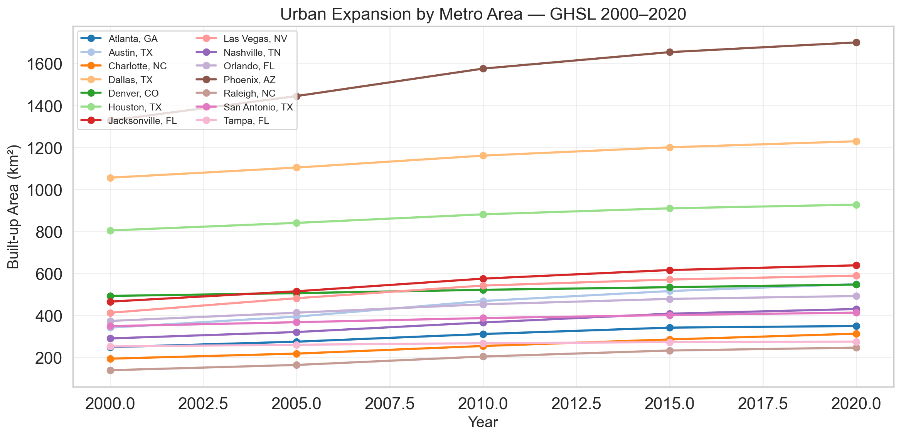
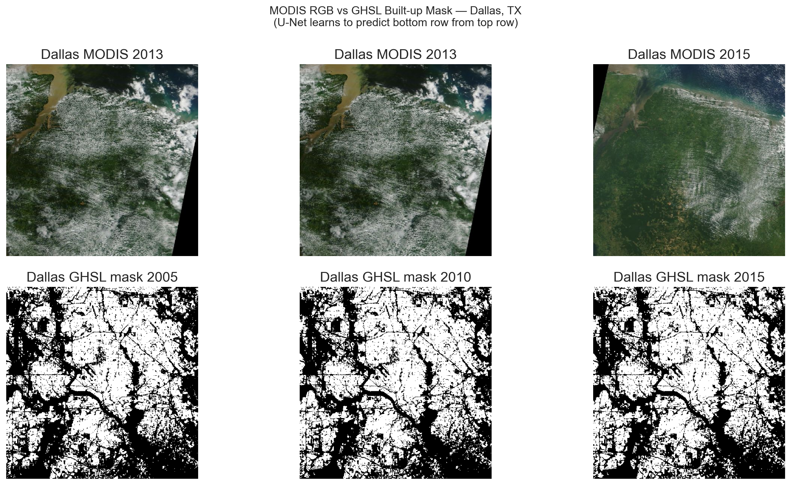
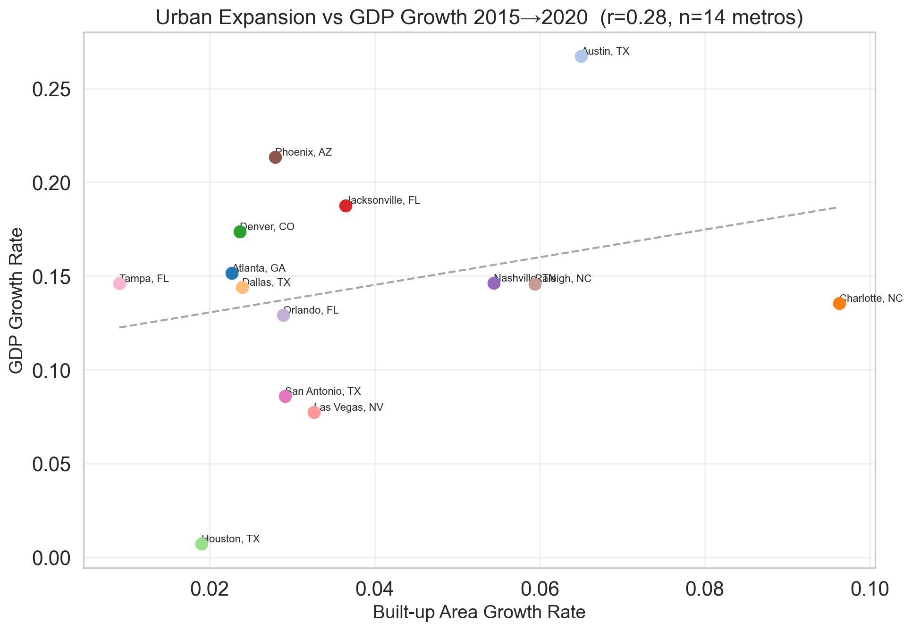
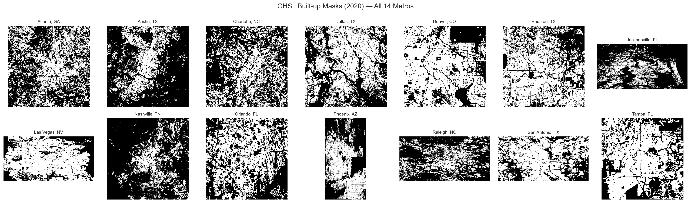

# Urban Expansion vs Economic Activity

This repository studies whether **satellite-observed urban change** can help predict **future metro-level economic activity** across a 14-metro U.S. panel. The current repository state has been refreshed so that the data inventory, EDA notebooks, preprocessing notebooks, and baseline-model notebook all point to the same restored 14-metro source of truth.

## Updated in This PR

This PR refreshes the repository-level artifacts without overwriting parts of the project that were already working well.

- the 14-metro data inventory, imagery, tensors, EDA notebooks, and baseline notebook now point to the same source of truth
- MODIS imagery is now collected from NASA GIBS using an audited metro-year acquisition manifest: for each metro and year, we search candidate dates, score cloud / gap quality, select the best available date, and then download the final mosaic from that selected date instead of using a fixed `08-01` rule
- the updated GHSL visuals are now part of the repository handoff and can be found in both [`figures/`](figures/) and [`EDA_Figures/`](EDA_Figures/)

## 1. Project Snapshot

| Item | Current status |
| --- | --- |
| **Core question** | Do lagged satellite signals help predict future metro-level GDP, employment, and permits? |
| **Geography** | 14 U.S. metros |
| **Panel span** | 2013-2023 |
| **Satellite inputs** | MODIS RGB summaries and VIIRS night-light summaries |
| **Economic inputs** | BEA GDP, BLS employment / unemployment, Census permits |
| **Current baseline target** | `employment_thousands_growth` |
| **Selected reporting baseline** | Ridge Regression on the expanded lagged panel |
| **Strongest nonlinear comparator** | Gradient Boosting Regressor |
| **Next scientific milestone** | Add GHSL / built-up spatial features and compare them against the raw-summary baseline |

## 2. Repository Guide

| Artifact | What it contains | Why it matters |
| --- | --- | --- |
| [`00_Final_EDA_Merged.ipynb`](00_Final_EDA_Merged.ipynb) | Canonical refreshed EDA + panel construction notebook | Builds the modeling panel and updated visual exports |
| [`00_Final_EDA_Merged_finalized.ipynb`](00_Final_EDA_Merged_finalized.ipynb) | Synced copy of the canonical EDA notebook | Keeps the finalized handoff notebook aligned with the current source of truth |
| [`Cathy_Comprehensive_EDA.ipynb`](Cathy_Comprehensive_EDA.ipynb) | Synced copy of the canonical EDA notebook | Avoids drift across teammate-facing EDA notebooks |
| [`Jenny_baseline_model_selection_and_justification.ipynb`](Jenny_baseline_model_selection_and_justification.ipynb) | Executed baseline-model milestone notebook | Runs model selection, tuning, evaluation, and interpretation |
| [`01_gibs_tile_fetcher_v5.ipynb`](01_gibs_tile_fetcher_v5.ipynb) | Satellite acquisition notebook | Now documents the per-metro-year MODIS date manifest rather than a fixed `08-01` rule |
| [`03_raster_preprocessing.ipynb`](03_raster_preprocessing.ipynb) | Raster preprocessing notebook | Now reflects the 14-metro scope and the `2020`-excluded evaluation split |
| [`MODELING_NEXT_STEPS.md`](MODELING_NEXT_STEPS.md) | Modeling roadmap | Defines the GHSL / spatial-feature stage and planned ablations |
| [`figures/`](figures/) | Presentation-ready exported visuals | Stores refreshed EDA and baseline figures used in slides and docs |

## 3. Pre-Final Refresh Status

This repo now includes a full **pre-final-model refresh** of the MODIS imagery, tensors, modeling tables, EDA notebooks, and baseline notebook.

| Refresh check | Current status | Rationale |
| --- | --- | --- |
| **14-metro inventory restored locally** | Yes | The notebooks and proposal describe a 14-metro project, so the local working tree must match that scope |
| **`upstream/main` still incomplete** | Yes | Published `main` still exposes only 5 metros, so local repair artifacts remain important |
| **MODIS acquisition moved off fixed `08-01`** | Yes | The final MODIS dates are now stored explicitly in [`data/imagery/modis_acquisition_manifest.csv`](data/imagery/modis_acquisition_manifest.csv) |
| **Broad-search + rescue workflow completed** | Yes | Every metro-year was searched on a broad spring-to-fall grid, and stubborn cases were re-searched on a year-round weekly grid |
| **Full MODIS rewrite completed** | Yes | All 154 metro-year MODIS GeoTIFFs were regenerated from the selected-date manifest |
| **Selected frames with missing tiles** | `0` | Selection now prioritizes full coverage first |
| **Selected frames with large dark gaps (`>5%`)** | `0` | This removes the black-wedge / cut-in-half failure mode from the chosen frames |
| **Residual high core-cloud cases (`>12%`)** | `6` | After the full rescue search, only a small Las Vegas-heavy subset remains above the center-visibility concern line |
| **Residual whole-frame high-diffuse cases (`>25%`)** | `3` | The cloudiest remaining frames are now explicit, bounded, and documented rather than hidden in the default fetch rule |

## 4. Data Integrity and Imagery Audit

### 4.1 Branch-level data status

| Ref / state | Panel metros | Imagery metros | Why it matters |
| --- | ---: | ---: | --- |
| **Current working tree** | 14 | 14 | This is the refreshed local source of truth used by the current notebooks |
| **`upstream/main`** | 5 | 5 | Incomplete relative to the stated project scope |
| **`upstream/rename-add-prefix`** | 14 | 14 | Most complete published branch-level snapshot from the earlier recovery step |

Rationale:
- a 5-metro branch is not a harmless subset; it is inconsistent with the notebooks, proposal framing, and exported figures
- the local refreshed artifacts should be treated as the working source of truth until the repaired state is merged to the team-facing branch

### 4.2 MODIS selection rule

The MODIS refresh no longer treats `08-01` as the source of truth.

The final selection rule is:
1. Prefer frames with **no missing tiles** and **`dark_or_empty_pct <= 5`**
2. Within those complete frames, minimize **center-region cloud risk**
3. Use whole-frame cloud metrics only as tie-breakers
4. For stubborn cases, run a **year-round weekly rescue search** instead of accepting the fixed seasonal heuristic

Rationale:
- this directly addresses the failure mode shown in teammate screenshots, where a frame can look “cut in half” even if the WMTS request technically succeeds
- a frame that preserves the city core and avoids black wedges is safer for downstream feature extraction than one that only looks cleaner in peripheral tiles
- the rescue search is only used after the broad spring-to-fall pass fails, so most metro-years still come from a seasonally comparable search window

### 4.3 Audit visuals


How to read these:
- the first figure summarizes **center-weighted** cloud risk by metro after the refresh
- the second figure shows the highest-risk remaining frames after enforcing the no-gap rule and the rescue-search workflow
- those residual cases are now **complete images**, so the remaining issue is cloudiness / bright-scene ambiguity rather than broken geometry

### 4.4 Audit artifacts

| Artifact | What it contains |
| --- | --- |
| [`deliverables/data_audit/DATA_INTEGRITY_AUDIT.md`](deliverables/data_audit/DATA_INTEGRITY_AUDIT.md) | Full written audit with the final rationale and interpretation notes |
| [`deliverables/data_audit/branch_data_status.csv`](deliverables/data_audit/branch_data_status.csv) | Branch-by-branch metro coverage snapshot |
| [`deliverables/data_audit/metro_imagery_audit.csv`](deliverables/data_audit/metro_imagery_audit.csv) | Metro-level inventory, geometry, and cloud summary |
| [`deliverables/data_audit/modis_cloud_year_audit.csv`](deliverables/data_audit/modis_cloud_year_audit.csv) | Year-level MODIS cloud-risk log after the refresh |
| [`deliverables/data_audit/modis_date_search/modis_date_candidates.csv`](deliverables/data_audit/modis_date_search/modis_date_candidates.csv) | Full candidate-date scoring table |
| [`deliverables/data_audit/modis_date_search/modis_date_search_summary.md`](deliverables/data_audit/modis_date_search/modis_date_search_summary.md) | Final selected date per metro-year after refinement |
| [`deliverables/data_audit/modis_date_search/modis_refinement_targets.csv`](deliverables/data_audit/modis_date_search/modis_refinement_targets.csv) | Final metro-years that still exceed the cloud thresholds even after refinement |
| [`deliverables/data_audit/modis_refresh_log.csv`](deliverables/data_audit/modis_refresh_log.csv) | Refresh log for all rewritten MODIS frames |
| [`data/imagery/modis_acquisition_manifest.csv`](data/imagery/modis_acquisition_manifest.csv) | The current source-of-truth MODIS acquisition manifest used by the notebooks |

### 4.5 Updated GHSL visuals

These figures summarize the repaired GHSL portion of the EDA and are the recommended visuals to inspect first when reviewing the urban-expansion signal.

**GHSL built-up expansion over time**



**MODIS brightness vs. GHSL built-up area**



**GHSL built-up change vs. GDP growth**



**GHSL masks across all metros and labeled epochs**



## 5. Baseline Modeling Notebook

The baseline-model notebook is:

- [`Jenny_baseline_model_selection_and_justification.ipynb`](Jenny_baseline_model_selection_and_justification.ipynb)

The notebook now reflects the refreshed pre-final data state and keeps the MS3 logic intact:

| Baseline component | Current notebook behavior |
| --- | --- |
| **Simple model** | Linear Regression with metro fixed effects |
| **Regularized reporting baseline** | Ridge Regression on the expanded lagged panel |
| **109B nonlinear comparator** | Gradient Boosting Regressor |
| **Tuning workflow** | Rolling-origin CV inside the training period only |
| **Official reporting split** | Train `2014-2018`, validation `2019`, test `2021-2023`, with `2020` excluded |
| **Primary selection rule** | Lowest rolling-CV mean MAE |

### 5.1 Modeling visuals


These visuals are the clearest way to read the notebook:
- the rolling-validation figure explains why the selected reporting baseline is chosen
- the official comparison figure shows how the tuned models compare on the held-out split
- the year-wise figure shows where the selected baseline is relatively easier or harder to trust

## 6. Current Source of Truth

If you only open three files, open these:

| Goal | File |
| --- | --- |
| **Understand the current data / EDA pipeline** | [`00_Final_EDA_Merged.ipynb`](00_Final_EDA_Merged.ipynb) |
| **Understand the current baseline-model deliverable** | [`Jenny_baseline_model_selection_and_justification.ipynb`](Jenny_baseline_model_selection_and_justification.ipynb) |
| **Understand the remaining modeling roadmap** | [`MODELING_NEXT_STEPS.md`](MODELING_NEXT_STEPS.md) |

## 7. Reproducibility

### 7.1 Full pre-final refresh

To rerun the entire pre-final refresh pipeline from the current repo state:

```bash
./.venv/bin/python scripts/run_pre_final_refresh.py
```

That umbrella script:
- searches candidate MODIS dates
- expands the search for problematic metro-years
- runs a year-round rescue search for the few metro-years that still exceed the cloud thresholds
- refreshes all MODIS GeoTIFFs
- reruns the imagery audit
- reruns the preprocessing and EDA notebooks
- regenerates the baseline-model notebook

### 7.2 Individual key commands

```bash
./.venv/bin/python scripts/search_modis_candidate_dates.py
./.venv/bin/python scripts/refine_modis_candidate_dates.py
./.venv/bin/python scripts/refresh_modis_from_selected_dates.py
./.venv/bin/python scripts/audit_data_integrity.py
./.venv/bin/python scripts/build_baseline_model_notebook.py
```

## 8. Interpretation Caveats

The refresh resolved the major structural problems. The remaining caveats are now explicit rather than hidden:

- `upstream/main` still does not reflect the repaired 14-metro state
- a small Las Vegas-heavy subset of frames remains cloudier than the rest even after the full rescue search
- bbox geometry is tile-stable, so the repo is internally consistent, but the imagery should still be interpreted as metro-aligned rasters rather than exact legal boundaries

Those caveats are now documented, bounded, and reviewable rather than silent pipeline errors.
