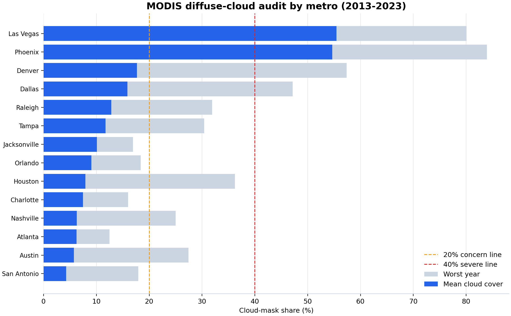
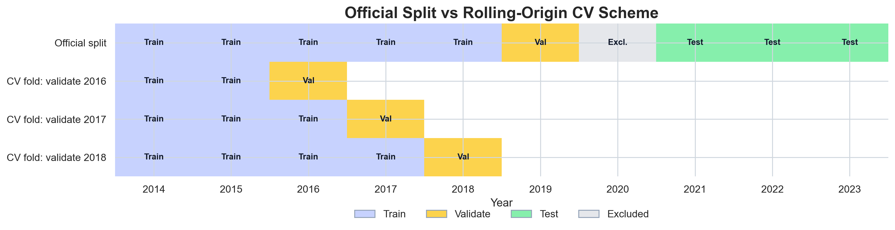
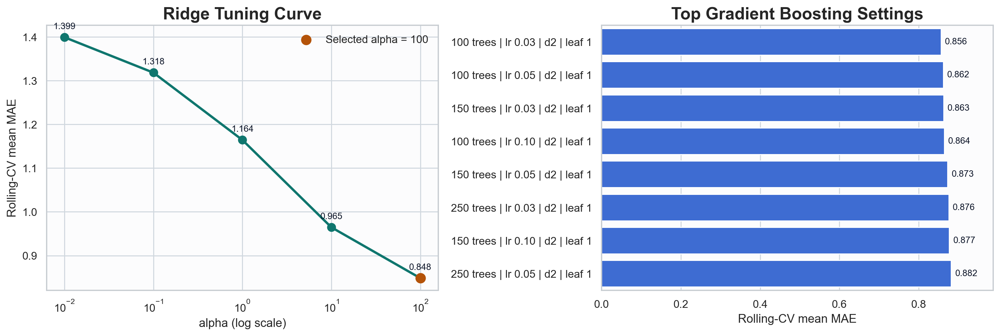
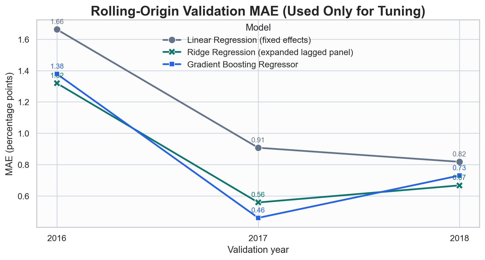
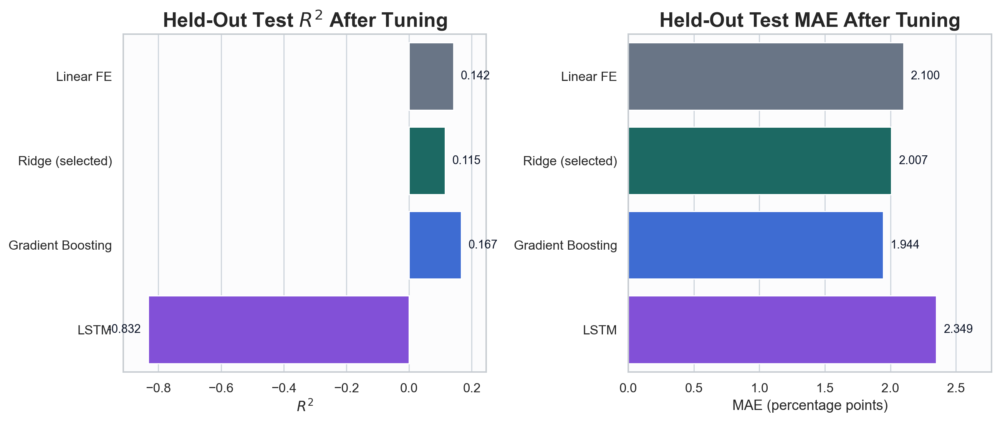
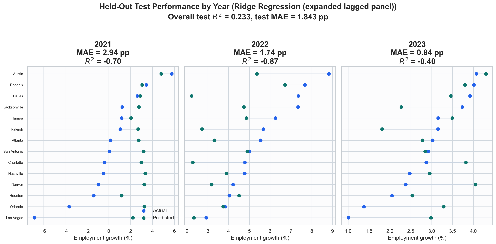
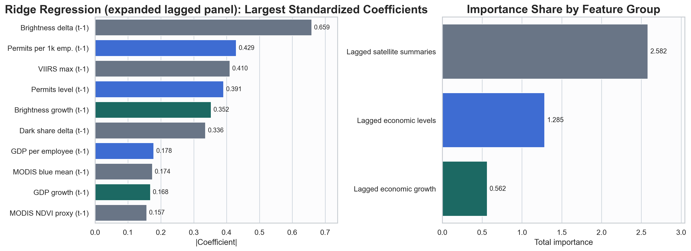
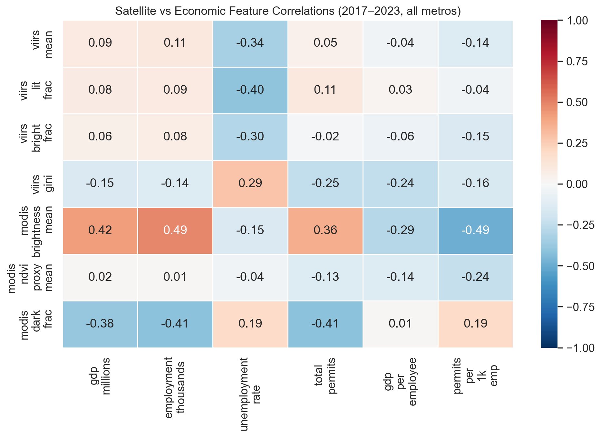

# Urban Expansion vs Economic Activity

This repository studies whether **satellite-observed urban change** can help predict **future metro-level economic activity**. The current deliverables already cover the data pipeline, exploratory data analysis, and a compact but time-aware baseline-model notebook.

The baseline-model milestone deliverable is:

- [`Jenny_baseline_model_selection_and_justification.ipynb`](Jenny_baseline_model_selection_and_justification.ipynb)

## 1. Project At a Glance

| Item | Current status |
| --- | --- |
| **Core question** | Do lagged satellite signals help predict future metro-level GDP, employment, and permits? |
| **Geography** | 14 U.S. metros |
| **Panel span** | 2013-2023 |
| **Satellite inputs** | MODIS RGB summaries and VIIRS night-light summaries |
| **Economic inputs** | BEA GDP, BLS employment / unemployment, Census permits |
| **Completed stages** | Data pipeline, unified panel construction, EDA, baseline modeling |
| **Baseline target in the notebook** | `employment_thousands_growth` |
| **Selected reporting baseline** | **Ridge Regression on the expanded lagged panel** |
| **Strongest official holdout performer** | **Gradient Boosting Regressor** |
| **Next scientific milestone** | Add GHSL / built-up spatial features and compare them against the raw-summary baseline |

## 2. Repository Guide

| Artifact | What it contains | Why it matters |
| --- | --- | --- |
| [`00_Final_EDA_Merged_finalized.ipynb`](00_Final_EDA_Merged_finalized.ipynb) | Main exploratory analysis notebook | Establishes the empirical motivation for time-aware modeling |
| [`Jenny_baseline_model_selection_and_justification.ipynb`](Jenny_baseline_model_selection_and_justification.ipynb) | Executed baseline-model milestone notebook | Runs model selection, tuning, evaluation, and interpretation |
| [`scripts/build_baseline_model_notebook.py`](scripts/build_baseline_model_notebook.py) | Notebook generator | Rebuilds the notebook and exports the baseline figures |
| [`MODELING_NEXT_STEPS.md`](MODELING_NEXT_STEPS.md) | Modeling roadmap | Defines the GHSL / spatial-feature stage and planned ablations |
| [`01_gibs_tile_fetcher_v5.ipynb`](01_gibs_tile_fetcher_v5.ipynb) | Satellite data acquisition | Downloads and mosaics NASA GIBS imagery |
| [`02_economic_data_downloader_v6.ipynb`](02_economic_data_downloader_v6.ipynb) | Economic data construction | Builds the metro-year target panel |
| [`03_raster_preprocessing.ipynb`](03_raster_preprocessing.ipynb) | Raster preprocessing pipeline | Produces cleaned, aligned satellite tensors |
| [`figures/`](figures/) | Presentation-ready exported visuals | Stores EDA and baseline-model figures used across the project |

## 3. Data Integrity and Imagery Audit

The project notebooks describe a **14-metro** study, so the published data inventory has to match that scope before any modeling claims are trustworthy. I ran a dedicated audit to check the current branch state, the local restored inventory, and the quality of the MODIS frames that feed the EDA and downstream modeling.

### 3.1 Branch-level data status

| Ref / state | Panel metros | Imagery metros | Why it matters |
| --- | ---: | ---: | --- |
| **Current working tree** | 14 | 14 | This is the restored local data state used by the audit |
| **`upstream/main`** | 5 | 5 | Incomplete for the stated project scope |
| **`upstream/rename-add-prefix`** | 14 | 14 | Most complete published branch-level source of truth right now |

Rationale:
- a 5-metro branch is not just a smaller sample; it is inconsistent with the 14-metro notebooks, figures, and proposal framing
- teammates should not keep building models from `main` until the 14-metro state is restored there
- the current local modeling tables (`data/modeling/panel_features.csv` and `data/modeling/panel_normalized.csv`) are also back to **14 metros**, so the restored local state is internally consistent for downstream modeling

### 3.2 MODIS quality findings



Key findings from the audit:
- `01_gibs_tile_fetcher_v5.ipynb` uses `08-01` as a **heuristic** default for lower cloud cover in CONUS, but that does not guarantee good imagery for every metro-year
- the notebook's current cloud filter is very strict and only catches nearly pure-white clouds, so it likely **underestimates** gray or hazy cloud contamination
- a broader diffuse-cloud proxy flags repeated high-risk years for metros such as **Phoenix** and **Las Vegas**, which means some current MODIS frames are weak evidence for visible urban expansion
- the saved raster dimensions are stable and always multiples of `512`, which is consistent with full GIBS tile mosaics; a rectangular image is therefore **not automatically** evidence that a city was cut in half

### 3.3 Candidate-date search for the worst metros

I also ran a compact MODIS date search for the highest-risk metros (`Phoenix`, `Las Vegas`, `Denver`, `Dallas`) across `2013-2023`, comparing `07-01`, `07-15`, `08-01`, `08-15`, and `09-01`.

What it showed:
- in **34 of 44** searched metro-years, `08-01` was **not** the best date under the diffuse-cloud metric
- large improvements exist for key problematic cases:
  - `Phoenix 2018`: `08-01` diffuse cloud `83.91%` → best candidate `2018-09-01` at `15.93%`
  - `Denver 2018`: `08-01` diffuse cloud `57.37%` → best candidate `2018-09-01` at `1.87%`
  - `Las Vegas 2021`: `08-01` diffuse cloud `80.07%` → best candidate `2021-07-15` at `39.03%`
  - `Dallas 2022`: `08-01` diffuse cloud `47.16%` → best candidate `2022-08-15` at `7.15%`

Rationale:
- this is the strongest current evidence that the fixed `08-01` rule should be replaced rather than merely caveated
- the search results are concrete enough to prioritize re-download work instead of re-auditing all metros blindly

### 3.4 Audit artifacts

| Artifact | What it contains |
| --- | --- |
| [`deliverables/data_audit/DATA_INTEGRITY_AUDIT.md`](deliverables/data_audit/DATA_INTEGRITY_AUDIT.md) | Full written audit with rationale and recommendations |
| [`deliverables/data_audit/branch_data_status.csv`](deliverables/data_audit/branch_data_status.csv) | Branch-by-branch metro coverage snapshot |
| [`deliverables/data_audit/metro_imagery_audit.csv`](deliverables/data_audit/metro_imagery_audit.csv) | Metro-level inventory, geometry, and cloud summary |
| [`deliverables/data_audit/modis_cloud_year_audit.csv`](deliverables/data_audit/modis_cloud_year_audit.csv) | Year-level MODIS cloud-risk log |
| [`deliverables/data_audit/modis_date_search/modis_date_search_summary.md`](deliverables/data_audit/modis_date_search/modis_date_search_summary.md) | Best candidate date per high-risk metro-year |
| [`deliverables/data_audit/modis_date_search/modis_date_candidates.csv`](deliverables/data_audit/modis_date_search/modis_date_candidates.csv) | Full candidate-date scoring table |
| [`scripts/audit_data_integrity.py`](scripts/audit_data_integrity.py) | Reproducible audit script |
| [`scripts/search_modis_candidate_dates.py`](scripts/search_modis_candidate_dates.py) | Candidate-date search tool for lower-cloud MODIS replacements |

## 4. Baseline Modeling Setup

### 4.1 Effective sample and split

| Component | Value |
| --- | --- |
| **Target** | `employment_thousands_growth` |
| **Raw panel rows** | 140 metro-year observations |
| **Rows used for modeling** | 126 observations with a defined growth target |
| **Training years** | `2014-2018` |
| **Validation year** | `2019` |
| **Held-out test years** | `2021-2023` |
| **Excluded year** | `2020`, treated as a COVID structural break |
| **Leakage control** | All predictive features are lagged; all splits are time-based |

### 4.2 Baseline models in the notebook

| Model | Why it is included | Role |
| --- | --- | --- |
| **Linear Regression with metro fixed effects** | Simplest interpretable benchmark | Transparent reference model |
| **Ridge Regression on an expanded lagged panel** | Keeps linear interpretability while handling a small, collinear feature space | **Selected reporting baseline** |
| **Gradient Boosting Regressor** | Standard Stat 109B nonlinear comparison that can capture interactions and thresholds | Strong nonlinear comparator |

## 5. Time-Aware Cross-Validation Workflow

The baseline notebook separates **tuning** from **official evaluation**.

| Stage | Years used | Purpose |
| --- | --- | --- |
| **Rolling-origin CV fold 1** | train on years before `2016`, validate on `2016` | Hyperparameter tuning |
| **Rolling-origin CV fold 2** | train on years before `2017`, validate on `2017` | Hyperparameter tuning |
| **Rolling-origin CV fold 3** | train on years before `2018`, validate on `2018` | Hyperparameter tuning |
| **Official validation** | `2019` | Model reporting only, not tuning |
| **Held-out test** | `2021-2023` | Final evaluation only |

The notebook uses **rolling-CV mean MAE** as the primary tuning criterion and reports rolling-CV mean `R^2` as secondary context.

### 5.1 Split structure



This visual makes the evaluation design explicit:

- the top row is the official train / validation / test split used for reporting;
- the lower rows are the historical rolling-origin folds used only for tuning;
- `2020` is excluded throughout.

### 5.2 Compact tuning search



The search is intentionally light:

| Model | Search space |
| --- | --- |
| **Linear Regression** | no tuning |
| **Ridge Regression** | `alpha ∈ {0.01, 0.1, 1, 10, 100}` |
| **Gradient Boosting** | small grid over `n_estimators`, `learning_rate`, `max_depth`, and `min_samples_leaf` |

This keeps the notebook defensible as a **baseline study** rather than a large optimization exercise.

## 6. Baseline Selection and Official Results

### 6.1 Selection rule

| Decision question | Answer |
| --- | --- |
| **Primary selection rule** | Lowest rolling-origin CV mean MAE |
| **Selected reporting baseline** | **Ridge Regression (expanded lagged panel)** with `alpha = 100` |
| **Why Ridge is selected** | It has the best average rolling-CV MAE under the pre-specified rule |
| **Strongest official validation / test performer** | **Gradient Boosting Regressor** with `100 trees`, `lr = 0.03`, `depth = 2`, `leaf = 1` |
| **Interpretation** | The small panel does not yield a one-number ranking, so the notebook reports both the selection rule and the holdout winner clearly |

### 6.2 Final model comparison

| Model | Selected hyperparameters | Rolling CV Mean MAE | Rolling CV Mean R^2 | Validation MAE | Test MAE | Test R^2 | Role |
| --- | --- | ---: | ---: | ---: | ---: | ---: | --- |
| **Linear Regression (fixed effects)** | default | 1.129 | -2.122 | 1.605 | 2.100 | 0.142 | Simple reference model |
| **Ridge Regression (expanded lagged panel)** | `alpha = 100` | **0.848** | -0.706 | 0.744 | 2.007 | 0.115 | **Selected reporting baseline** |
| **Gradient Boosting Regressor** | `100 trees`, `lr = 0.03`, `depth = 2`, `leaf = 1` | 0.856 | **-0.162** | **0.617** | **1.944** | **0.167** | Strongest nonlinear comparison |

## 7. Essential Modeling Visuals

### 7.1 Rolling-CV stability vs official holdout comparison

<p align="center">
  
  
</p>

Read these two figures together:

- the left panel shows how each tuned model behaves across the historical rolling holdout years;
- the right panel shows official validation and held-out test performance after refitting on the full training window.

### 7.2 Selected baseline diagnostics

<p align="center">
  
  
</p>

These figures answer two practical follow-up questions:

- how the selected baseline behaves across `2021`, `2022`, and `2023`;
- which lagged feature groups contribute most to its predictions.

## 8. EDA Anchor



The EDA already suggested that **within-metro temporal relationships are more useful than pooled cross-city relationships**. That is exactly why the baseline-model notebook uses lagged predictors, time-based splits, and rolling-origin validation instead of random cross-validation.

## 9. Reading Order

| If you want to understand... | Start here |
| --- | --- |
| **The exploratory evidence behind the project** | [`00_Final_EDA_Merged_finalized.ipynb`](00_Final_EDA_Merged_finalized.ipynb) |
| **The baseline-model milestone deliverable** | [`Jenny_baseline_model_selection_and_justification.ipynb`](Jenny_baseline_model_selection_and_justification.ipynb) |
| **What the next modeling stage should do** | [`MODELING_NEXT_STEPS.md`](MODELING_NEXT_STEPS.md) |

## 10. Reproducibility

To regenerate the notebook and the exported baseline figures:

```bash
python3 scripts/build_baseline_model_notebook.py
```

The generator writes directly to:

```text
Jenny_baseline_model_selection_and_justification.ipynb
```

To rerun the data-integrity and MODIS-quality audit:

```bash
python3 scripts/audit_data_integrity.py
```

To rerun the MODIS candidate-date search for the highest-risk metros:

```bash
python3 scripts/search_modis_candidate_dates.py
```
